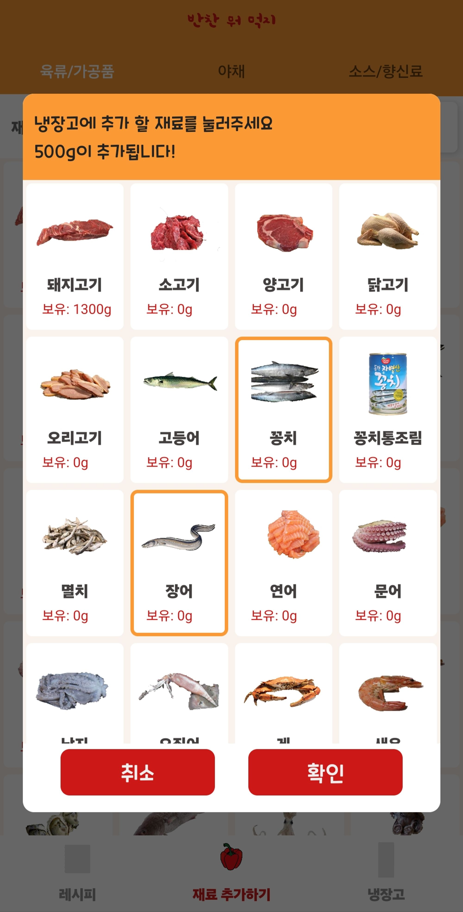
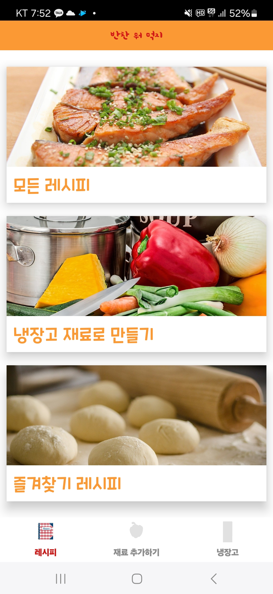
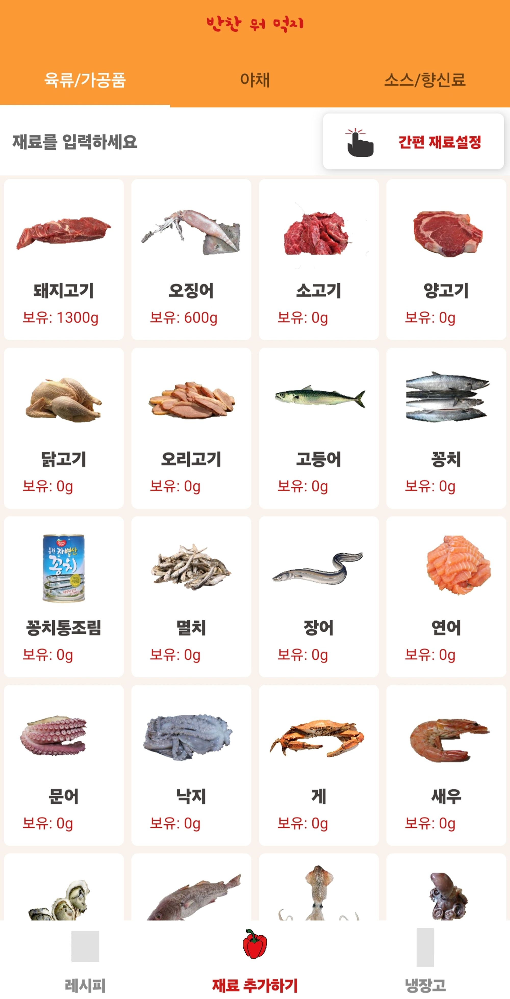
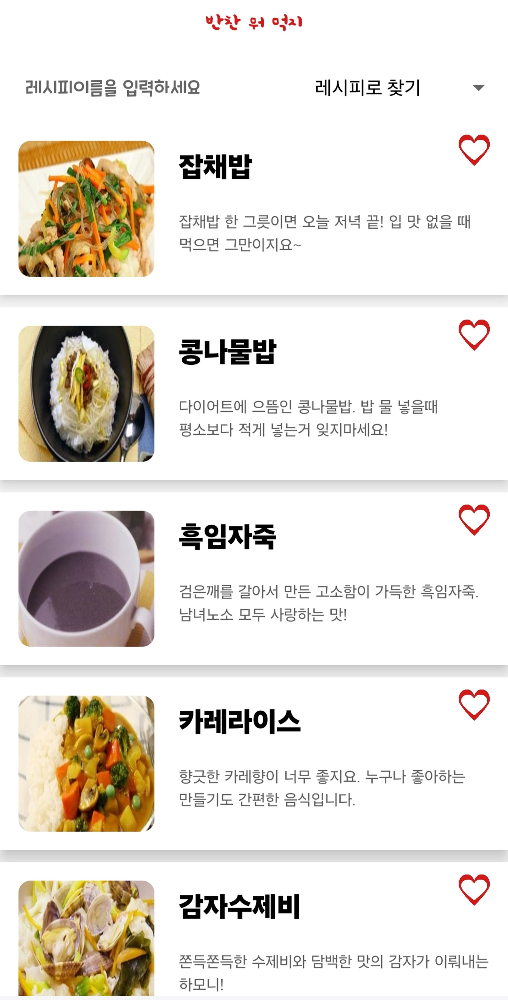

# 반찬 뭐 먹지? (개인 프로젝트) - 안드로이드 개발

2020-03 ~ 2020-06

어머니께서 반찬을 만드실 때 항상 재료가 부족하다고 하셔서, 이 문제를 해결하기 위해 앱 개발에 대한 기초 지식 없이 스스로 공부하며 개발을 시작하게 되었습니다.

## 프로젝트 개요

- 반찬 뭐 먹지?는 안드로이드 기반으로 사용자가 재료를 추가하면 냉장고 속 재료들을 기반으로  만들 수 있는 레시피 리스트를 보여주는 안드로이드 앱입니다.
- 공공 데이터를 활용한 안드로이드 앱입니다.
- 구글 플레이 1500+ 이상의 사용자가 다운로드 하였습니다.

## 프로젝트 개발

- 애플리케이션 전체 구조 설계 및 구현
- Room을 사용한 로컬 데이터베이스 설계 및 데이터 처리 로직 구현
- RecyclerView 및 ViewAdapter를 사용한 UI 구현
- 애플리케이션 성능 최적화 및 버그 수정

## **주요 기능:**

**사용자 입력을 통한 재료 추가**

- Fragment 를 활용하여 재료 종류 별 리스트 페이지 분류
- 재료 검색 기능 추가
- 간편 재료 추가 기능 (500g 단위)

**재료를 기반으로 가능한 레시피 추천**

- 주 재료, 부가 재료, 조미료로 재료를 분리하여, 주 재료를 보유 할 때 해당 레시피를 보여주도록 설정하였습니다.

**레시피 상세 보기 기능**

- 공공 데이터 API 의 레시피 JSON 데이터를 가져와 레시피의 재료와 요리 절차를 다이얼 로그로 표시하였습니다.
- RecylerView 를 활용하여 레시피 리스트를 나열 하였습니다.

**재료 관리 기능**

## **개선 사항:**

### 💽 개선 이유:

- 데이터 베이스에 대한 개념을 공부하기 전 개발한 앱으로 직접 데이터를 작성하여, 핸드폰 내장 메모리에 저장하여 사용 이로 인해 데이터가 핸드폰 갤러리에 저장되는 악영향 발생.

### 🔧 개선 현황:

- 데이터 베이스에 대한 전공 지식을 습득한 후 Room 데이터 베이스 적용 및 데이터 베이스 쿼리 작성 하여 관련 로직 구현
- Java로 작성되었던 전 코드를 → Kotiln으로 전환하여 구조 및 전체 코드 리팩토링

## 기술 스택:

- Java
- Kotlin
- Android SDK
- Room database